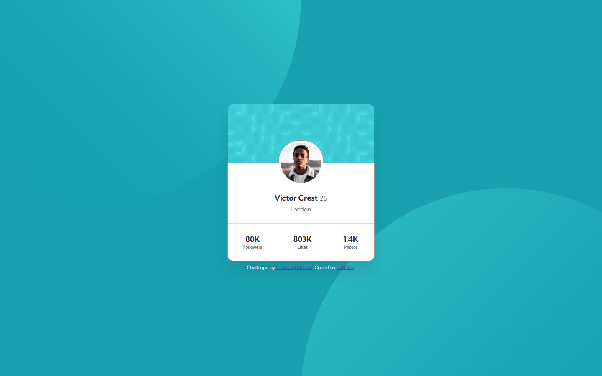

# Frontend Mentor - Profile card component solution

This is my solution to the [Profile card component challenge on Frontend Mentor](https://www.frontendmentor.io/challenges/profile-card-component-cfArpWshJ).

## Table of contents

- [Overview](#overview)
  - [The challenge](#the-challenge)
  - [Screenshot](#screenshot)
  - [Links](#links)
- [My process](#my-process)
  - [Built with](#built-with)
  - [What I learned](#what-i-learned)
  - [Continued development](#continued-development)
  - [Useful resources](#useful-resources)
- [Author](#author)

## Overview

### The challenge

- Build out the project to the designs provided

### Screenshot



### Links

- Solution URL: [https://github.com/daHatta/fem-profile-card-component](https://github.com/daHatta/fem-profile-card-component)
- Live Site URL: [https://dahatta.github.io/fem-profile-card-component/](https://dahatta.github.io/fem-profile-card-component/)

## My process

### Built with

- Semantic HTML5 markup
- CSS custom properties
- Flexbox
- Mobile-first workflow

### What I learned

This low level challenge had hidden some nice tricky issues for me.

One was the need to setup two background images which follow all design layouts.

```css
/* ... */
body {
    /* ... */
    background-attachment: fixed;
    background-color: var(--clr-pry-dark-cyan);
    background-image: url("../images/bg-pattern-top.svg");
    background-position: top calc(100vh * -0.5) right calc(100vw * 0.5);
    background-repeat: no-repeat;
    /* ... */
}
/* ... */
.container::after {
    background-image: url("../images/bg-pattern-bottom.svg");
    background-repeat: no-repeat;
    bottom: calc(100vh * -0.5);
    content: "";
    height: 100vh;
    left: calc(100vw * 0.5);
    position: absolute;
    width: 100vw;
    z-index: -1;
}
/* ... */
```

Another twist was found on the profile-image which has a big white border with a thin gray outline which continues to the left and right of the profile-image. In order to solve this design feature 
I used ::before to create a pseudo-element which looks like a half-circle and placed behind the profile-image.

```css
/* ... */
.profile-card__user-data::before {
    background-color: var(--clr-ntl-white);
    border-radius: 48px 48px 0 0;
    content: "";
    display: inline-block;
    height: 52px;
    margin-top: -53px;
    outline: 1px solid var(--clr-ntl-dark-gray);
    outline-offset: 0;
    width: 106px;
}
/* ... */
```

### Continued development

Useful challenge to exercise CSS and HTML-Markup.

### Useful resources

- [A (more) Modern CSS Reset](https://piccalil.li/blog/a-more-modern-css-reset/) - This article by **Andy Bell** helped me to reset websites for browser.
- [background-image](https://developer.mozilla.org/en-US/docs/Web/CSS/background-image) - Useful resource for implementing background images on your website by **Modzilla**.
- [Creating CSS Half Circle](https://unused-css.com/blog/css-half-circle/) - Article on **Unused CSS**.
- [Google Fonts](https://fonts.google.com/specimen/Kumbh+Sans) - Font *Kumbh Sans* used in this project.

## Author

- Frontend Mentor - [@daHatta](https://www.frontendmentor.io/profile/daHatta)
